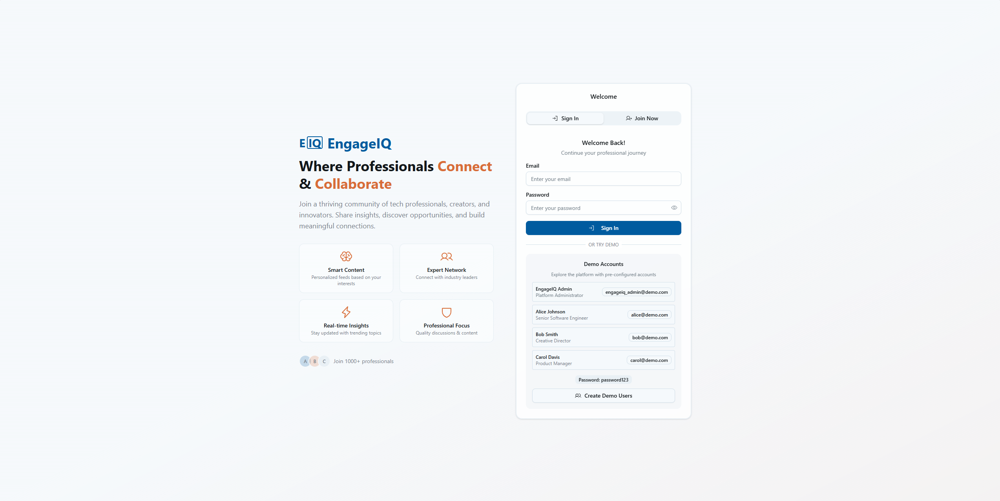
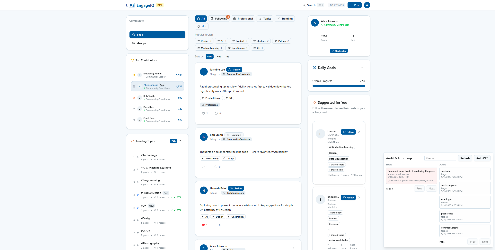
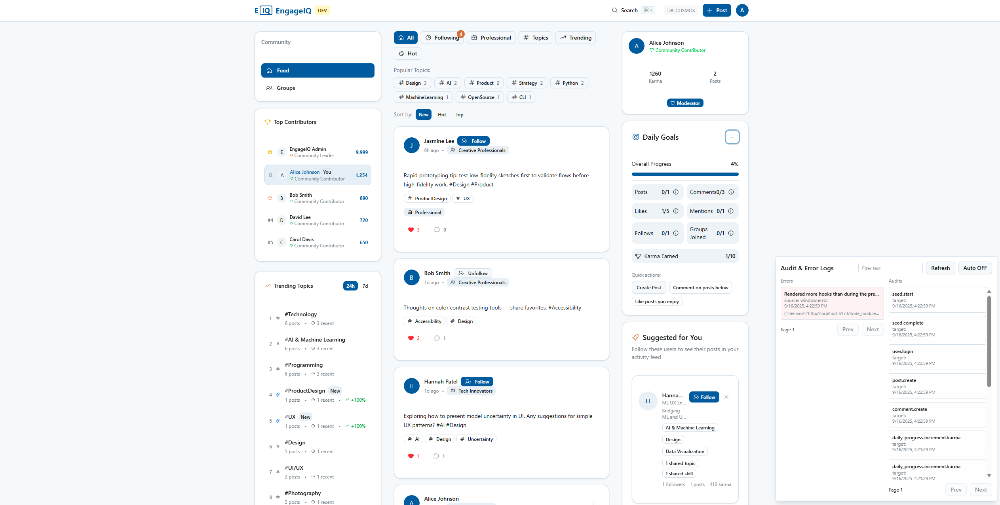
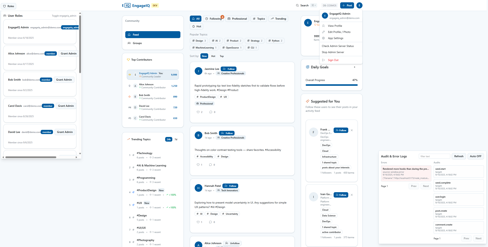

# EngageIQ 

This repository contains two main projects:

- frontend — Vite + React + TypeScript application (UI)
- backend — Node.js server and administrative tooling (scripts, seeders, setup)

The repository has been reorganized so that all server/infra/deployment scripts and utilities live under `backend/scripts`. The frontend is focused on app code only.

### Technology stack

High-level technologies used in this monorepo:

- Frontend (frontend/)
  - React 19 + TypeScript
  - Vite (dev server / bundler)
  - Tailwind CSS + PostCSS for styling
  - Radix UI primitives, Heroicons / Phosphor / Lucide icon sets
  - Utility libs: clsx, class-variance-authority, sonner (toasts)
  - Test & tooling: Vitest, ESLint, TypeScript, tsc, ts-node for scripts

- Backend & scripts (backend/)
  - Node.js + TypeScript admin server (Express)
  - Azure Cosmos DB via `@azure/cosmos` for persistence (per-type containers)
  - Azure OpenAI and Foundry (including local) for post rewrites, recommendations and AI enhancements 
  - Logging: pino / pino-pretty
  - Dev tooling: ts-node, ts-node/esm, TypeScript compiler
  - All administrative scripts centralized under `backend/scripts/` (seeders, migrations, smoke tests)

- Dev & infra
  - dotenv for local env loading; cross-env used in npm scripts
  - Seed & migration helpers in `backend/scripts/` (see `docs/scriptsDocumentation.md`)


---

## Quickstart

Requirements: Node 18+, npm (or pnpm/yarn)

1) Install dependencies

- Frontend
  - cd frontend
  - npm install

- Backend
  - cd backend
  - npm install

2) Run development servers

- Frontend (in one terminal)
  - cd frontend
  - npm run dev

- Backend (in another terminal)
  - cd backend
  - npm run dev

Note: The backend uses a TypeScript admin service. The canonical source is `backend/src/index.ts` (compiled to `backend/dist/index.js`). Use the npm scripts in `backend/package.json` (e.g., `ts:dev`, `ts:build`, `ts:start`, `ts:detach`). Several admin endpoints still invoke scripts in `backend/scripts` (e.g., reseed, autotag, rewrite).

---

## Scripts and tooling

All administrative and infrastructure scripts were moved to `backend/scripts`.

- To run a script directly:
  - cd backend && node ./scripts/<script-name>.mjs

See developer-facing script documentation for details: `docs/scriptsDocumentation.md`.

Developer notes on platform mechanics (karma/idempotency) are available at `docs/karma.md`.

- Useful npm scripts (from `backend/package.json`):
  - `npm run dev` — run server with file watching (Node's --watch)
  - `npm run seed` — run `./scripts/fresh-seed-all.mjs` (populate demo data)
  - `npm run setup` — run `./scripts/setup.mjs` (interactive setup helpers)
  - `npm run ensure-containers` — create Cosmos containers and seed if needed
  - `npm run postinstall-setup` — convenience postinstall tasks

The `frontend/scripts` folder previously contained many utilities. Those scripts have been moved; many frontend copies were replaced with one-line stubs and have now been removed to avoid duplication. Always use the canonical versions under `backend/scripts`.

If you need to run a script that used to live in `frontend/scripts`, look for it in `backend/scripts` and run it from the backend folder.

---

## Environment variables

Frontend (Vite): environment variables used in the UI must be prefixed with `VITE_`.

- Example frontend `.env.development` / `.env.production` (place in `frontend/`):
  - VITE_COSMOS_ENDPOINT
  - VITE_COSMOS_KEY
  - VITE_COSMOS_DATABASE_NAME
  - VITE_COSMOS_CONTAINER_NAME
  - VITE_APP_NAME
  - VITE_ENVIRONMENT
  - VITE_API_BASE_URL
  - VITE_APP_VERSION

Backend (server and scripts): put a `.env` file in `backend/` (or set env variables in your environment).

- Typical backend variables used by scripts and server:
  - VITE_COSMOS_ENDPOINT
  - VITE_COSMOS_KEY
  - VITE_COSMOS_DATABASE_NAME
  - AUTOTAG_PROVIDER (optional)
  - AOAI_ENDPOINT, AOAI_KEY, AOAI_DEPLOYMENT, AOAI_API_VERSION (if using Azure OpenAI/Foundry)

There is a `backend/.env.example` you can use as a starting point.

---

## Seeding the database

To seed sample/demo data (Cosmos DB seeder):

- cd backend
- npm run seed

Or run the seeder directly:

- node ./scripts/fresh-seed-all.mjs    # full seed flow (creates containers, seeds data)
- node ./scripts/seed-data.mjs         # module/helper that can be imported or run by other scripts

---

## After the migration

- The frontend no longer contains operational scripts. This keeps the UI code focused on the app and avoids accidental execution of infrastructure tasks from the frontend folder.
- If you want the deletions recorded in Git, commit your changes from the repository root (for example):
  - git add -A
  - git commit -m "Move scripts to backend/scripts and remove frontend stubs"

---

## Troubleshooting

- If a server endpoint reports a missing script, ensure you are running the server from `backend/` so it can resolve `./scripts/<name>.mjs` relative to the current working directory.
- If `git` is not initialized in this workspace, file removals may not be staged/committed — initialize a repo if needed or commit changes from your normal development environment.

---

## Working with this repository (recommended)

Follow these simple conventions to avoid directory-related mistakes (PowerShell examples):

- From the repository root (safe):
  - Start frontend dev server:
    - cd frontend; npm run dev
  - Start backend dev server:
    - cd backend; npm run dev
  - Run a backend script (no `cd` needed if you use the repo-relative path):
    - node .\backend\scripts\fresh-seed-all.mjs

- From inside the `backend/` folder (safe):
  - Run a backend script by name (relative to backend):
    - node .\scripts\fresh-seed-all.mjs
  - Run npm commands defined in `backend/package.json`:
    - npm run seed
    - npm run dev

Notes and common pitfall

- Avoid running `cd backend; <command>` when you are already inside the `backend` folder — that attempts to change into `backend\backend` and will error. Either run the repo-relative node command from root or run the script relative to the `backend` folder.

- Prefer explicit repo-relative paths from the repository root when scripting or CI jobs, e.g.: `node ./backend/scripts/fresh-seed-all.mjs`. This avoids errors caused by an unexpected current working directory.

- We previously created a convenience wrapper script `run-backend.ps1` in the repo root; it has now been removed. Use the commands above instead for clarity and reproducibility.

---

## Logging and tailing the backend (PowerShell)

When developing, it is convenient to capture server stdout/stderr to a log file and tail it so you can view logs from any terminal.

1) Stop any running backend process (optional but recommended before restarting with logging):

```powershell
# Ask the admin endpoint for the current pid (dev mode requires the X-User-Id header)
$resp = (Invoke-WebRequest -Uri http://localhost:4000/admin/status -UseBasicParsing -TimeoutSec 5 -Headers @{ 'x-user-id' = 'demo-user-admin' }).Content | ConvertFrom-Json
if ($resp.pid) { Stop-Process -Id $resp.pid -Force }
```

2) Start backend and write logs to file (foreground):

```powershell
cd backend
# Write stdout+stderr to server.log and show it in the terminal
npm --prefix backend run ts:dev 2>&1 | Tee-Object -FilePath backend/server.log
```

Or, use the provided npm helper scripts from `backend/package.json`:

```powershell
# Foreground (stream logs to console and append to backend/server.log)
npm --prefix backend run ts:dev

# Detached/background (build & start background process; logs: backend/server.log and backend/server.err.log)
npm --prefix backend run ts:detach
```

When started through the npm helpers the log files will be in `backend/server.log` (stdout) and `backend/server.err.log` (stderr for detached runs).

3) Start backend as a background PowerShell job (detached-ish) and write logs to file:

```powershell
Start-Job -Name engageiq-server -ScriptBlock {
  Set-Location 'C:\Usha\UKRepos\eiq\backend'
  # Write stdout+stderr to server.log and also stream to the job's output
  npm --prefix backend run ts:dev 2>&1 | Tee-Object -FilePath backend/server.log
}
```

4) Tail the log file from another terminal (live view):

```powershell
# from repository root
Get-Content .\backend\server.log -Wait -Tail 200
```

5) Start a non-blocking tail job that appends live updates into server-tail.log (so you can open or tail it later):

```powershell
Start-Job -Name engageiq-tail -ScriptBlock {
  Set-Location 'C:\Usha\UKRepos\eiq\backend'
  if (-not (Test-Path '.\server.log')) { New-Item -Path '.\server.log' -ItemType File | Out-Null }
  Get-Content .\server.log -Wait | Out-File -FilePath server-tail.log -Append
}
```

6) Fetch recent output from the tail file (non-blocking):

```powershell
Get-Content .\backend\server-tail.log -Tail 200
```

7) Check the job status and watch recent captured output (non-blocking):

```powershell
Get-Job -Name engageiq-server,engageiq-tail
Get-Job -Name engageiq-server | Receive-Job -Keep -ErrorAction SilentlyContinue
```

8) Manage the background job

```powershell
# show job
Get-Job -Name engageiq-server
# fetch current captured output (non-destructive)
Get-Job -Name engageiq-server | Receive-Job -Keep -ErrorAction SilentlyContinue
# stop job
Get-Job -Name engageiq-server | Stop-Job -Force
# remove job
Get-Job -Name engageiq-server | Remove-Job
```

Stop and remove the background jobs when you’re done:

```powershell
Get-Job -Name engageiq-tail | Stop-Job -Force; Get-Job -Name engageiq-tail | Remove-Job
Get-Job -Name engageiq-server | Stop-Job -Force; Get-Job -Name engageiq-server | Remove-Job
```

Notes
- You must restart the server to enable logging to a file; you cannot retroactively capture stdout of an already-running process.
- The admin endpoints require the `x-user-id` request header in dev mode. Use a seeded demo user such as `demo-user-admin` when calling admin endpoints from scripts or Invoke-WebRequest.
- These jobs run in separate PowerShell sessions on the machine and will keep running while your editor is open. They are convenient for development but consider using a proper process manager for long-lived services in production.

## Cleanup: stopping background jobs and removing logs

If you used the PowerShell background job approach or the detached npm helper, you can clean up resources and logs as follows:

- Stop/remove background PowerShell jobs (if you used Start-Job):

```powershell
# Stop the tail job (if running)
Get-Job -Name engageiq-tail -ErrorAction SilentlyContinue | Stop-Job -ErrorAction SilentlyContinue
Get-Job -Name engageiq-tail -ErrorAction SilentlyContinue | Remove-Job -ErrorAction SilentlyContinue

# Stop the server job (if running)
Get-Job -Name engageiq-server -ErrorAction SilentlyContinue | Stop-Job -ErrorAction SilentlyContinue
Get-Job -Name engageiq-server -ErrorAction SilentlyContinue | Remove-Job -ErrorAction SilentlyContinue
```

- If you started a detached server using `npm --prefix backend run ts:detach` (or ran the detacher directly), stop it by PID:

```powershell
# Option 1: if you know the PID printed when the detached process was started
Stop-Process -Id <PID> -Force

# Option 2: use the admin endpoint (dev) to find the PID programmatically
$resp = (Invoke-WebRequest -Uri http://localhost:4000/admin/status -UseBasicParsing -TimeoutSec 5 -Headers @{ 'x-user-id' = 'demo-user-admin' }).Content | ConvertFrom-Json
if ($resp.pid) { Stop-Process -Id $resp.pid -Force }
```

- Remove or rotate logs when finished (example):

```powershell
# Remove current logs (BE CAREFUL — this deletes log contents)
Remove-Item .\backend\server.log -Force -ErrorAction SilentlyContinue
Remove-Item .\backend\server.err.log -Force -ErrorAction SilentlyContinue
Remove-Item .\backend\server-tail.log -Force -ErrorAction SilentlyContinue
```

Notes
- When you stop a detached process by PID, confirm the PID belongs to the node process that serves EngageIQ before killing.
- If you prefer automated rotation, integrate a log rotation utility or run a scheduled task to trim logs periodically.

### Backend TypeScript service (dev and build)

We added a TypeScript-based admin service and helper npm scripts in `backend/package.json`.

- Install backend deps (including dev dependencies):

```powershell
cd backend
npm install
```

- Run the TypeScript dev server (hot reload):

```powershell
npm --prefix backend run ts:dev
```

- Build for production (transpile to `backend/dist`):

```powershell
npm --prefix backend run ts:build
```

- Start the built server (after build):

```powershell
npm --prefix backend run ts:start
```

### Non-blocking TypeScript run (build + detach)

If you compiled the TypeScript service and want to run it in the background in a non-blocking way, use the helper:

```powershell
# Build + start detached (background) -> prints PID and exits
npm --prefix backend run ts:detach

# Clean logs when you are done
npm --prefix backend run logs:clean
```

This uses the `backend/scripts/ts-detach.mjs` helper which builds (`tsc`) and starts the built server as a detached node process, writing stdout/stderr to `backend/server.log` / `backend/server.err.log`.

### Metrics and readiness

- Health (basic): `GET /health` — indicates server is reachable
- Readiness (DB): `GET /ready` — returns 200 when the server can access the database, 500 otherwise
- Prometheus metrics: `GET /metrics` — returns simple metrics in Prometheus text format (uptime & readiness)

### Logging: pino

The server uses pino for structured logging. In development `pino-pretty` is enabled to show pretty logs on the console. In production pino emits compact JSON suitable for ingestion into log systems.

- To run the TypeScript dev server (see above) with pretty output (default in non-production):

```powershell
# development (ts-node): pretty logs
npm --prefix backend run ts:dev

# built app (production): logs will be JSON
npm --prefix backend run ts:build
npm --prefix backend run ts:start
```

### CLI wrapper

A small CLI wrapper helps run common scripts with a consistent interface:

```powershell
# from repo root
npm --prefix backend run cli -- seed
npm --prefix backend run cli -- compute-vectors
npm --prefix backend run cli -- validate-cosmos
```

Note: `compute-vectors` runs the built TypeScript helper (`dist/ai.js`), so run `npm --prefix backend run ts:build` first.

## Canonical backend commands (copy/paste)

- Install backend deps:
  - npm --prefix backend install

---

## UI assets and example screens

The repository includes a small `assets/` folder that contains example UI screen images used for documentation, demos, and design reference. These are PNG screenshots that show the major app states and roles.

- `assets/login.png` — Login page
  - Purpose: visual reference for the login / onboarding screen used in the app. Shows the login form layout, demo user hints, and any welcome copy. Useful for designers or for README/demo pages where you want to showcase the entry point.

- `assets/usermain.png` — Logged-in user main UI
  - Purpose: snapshot of the main user experience after login. Demonstrates the primary feed, navigation, and user-level controls. Use this when explaining user-facing features or when creating screenshots for releases.

- `assets/karma_goals.png` — Karma & daily goals UI
  - Purpose: highlights the karma points, daily goals card, and progress UI (small widget or card). Reference this image when documenting the karma system, daily engagement widget, or when writing developer docs for `frontend/src/components/DailyEngagementWidget.tsx` and related hooks (`useKarmaSystem`).

- `assets/adminmain.png` — Admin / power-user UI
  - Purpose: shows the admin dashboard or the elevated UI available to power admins. Useful when documenting admin features in `backend/` and when highlighting privileged functionality such as seeding, audits, or moderation tools.

Guidance on usage
- These files are included for documentation and demo purposes only. They are not embedded in the build process.
- If you publish this repository publicly, the images are safe to include; however, avoid embedding any live secrets in screenshots (none of these should contain secrets). If you want to strip sensitive text from screenshots, keep an additional sanitized copy in `assets/`.
- To include a screenshot in the README or other markdown files, use a relative link, for example:

```markdown

```

Related files/components
- `frontend/src/components/AuthScreen.tsx` — login flow and demo account setup
- `frontend/src/components/DailyEngagementWidget.tsx` — karma / goals UI
- `frontend/src/components/AdminRolePanel.tsx`, `ModerationDashboard.tsx` — admin UI patterns

### Quick thumbnails

Login

<div align="center">
  
</div>

User main

<div align="center">
  
</div>

Karma & goals

<div align="center">
  
</div>

Admin UI

<div align="center">
  
</div>


- Dev server (TypeScript, hot reload):
  - npm --prefix backend run ts:dev

- Build for production:
  - npm --prefix backend run ts:build

- Start built server:
  - npm --prefix backend run ts:start

- Build + start detached (background):
  - npm --prefix backend run ts:detach

- Seed demo data (destructive):
  - npm --prefix backend run seed

- Run CLI wrapper (examples):
  - npm --prefix backend run cli -- seed
  - npm --prefix backend run cli -- validate-cosmos
